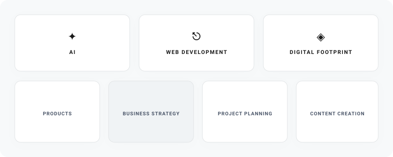

# Hey there, I'm Angela! 

  

---

## About Me

> I'm Angela Guilherme — a web developer, digital professional and entrepreneur focused on building practical digital products, websites and applications while connecting technology with business strategy, communication and real-world user needs.

**Building · Learning · Creating**

## Tech Stack

  

---

## Featured Projects

*Sweater-Weather 
Online store that sells Premium sweatshirts, tunic and knitwear for women- demo project

*Render-todo-app- 
TypeScript

*Vaulty - premium private workspace for passwords, notes, reminders and documents 
TypeScript 

*Personal-finance-guide- 
React Personal Finance Guide app

*My Library - with books I've read and the books I want to read.
JavaScript 

*Velora-events Public
Events management company
CSS 

*COOKIE CLICKER- Foundry · HTML · CSS · JS/ Cookie-Clicker–Game 

**Ongoing Projects**

Smart Task Manager
Full-stack health & life management app with authentication and analytics dashboard.

Developer Navigation Tracker
API-powered navigation correction system with live updates and smart filtering.

Kimanu Beauty Hair
Modern professional business website with responsive design and SEO optimization.

---

---

**Let's Connect. Have a great day!**

